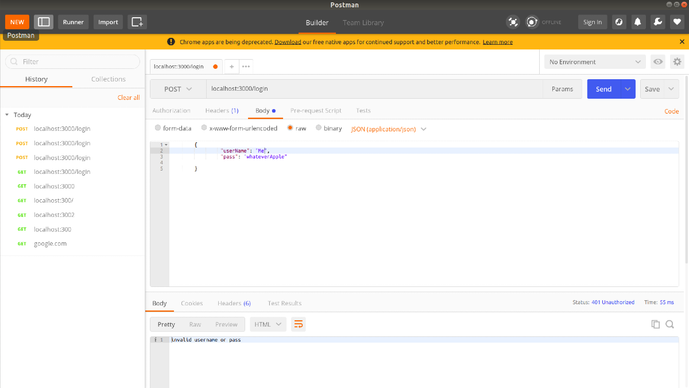
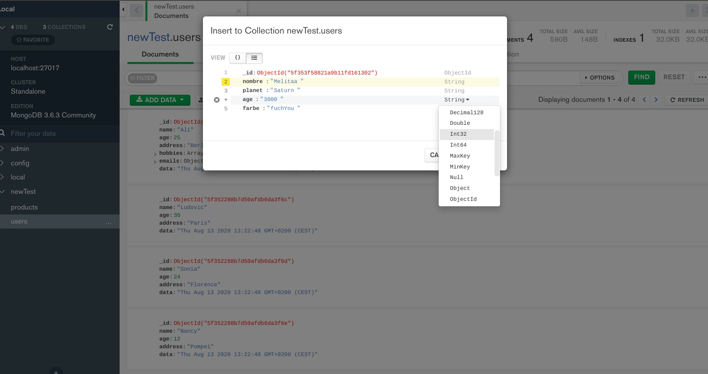

## DATABASE Lessons

MERN Stack: MERN Stack is a Javascript Stack that is used for easier and faster deployment of full-stack web applications. MERN Stack comprises of 4 technologies namely: MongoDB, Express, React and Node.js. It is designed to make the development process smoother and easier.
Each of these 4 powerful technologies provides an end-to-end framework for the developers to work in and each of these technologies play a big part in the development of web applications.

 

 
 

- Lowdb | sending requests using postman
  

- MIDDLEWARE
  

* MONGO (introduction to Databases with mongo)
  
