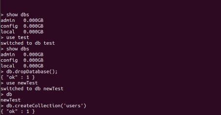
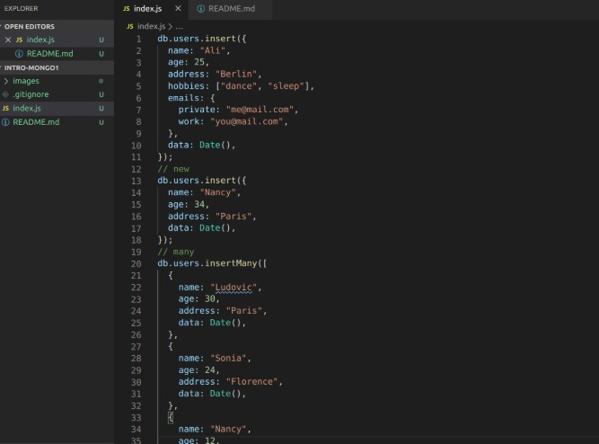
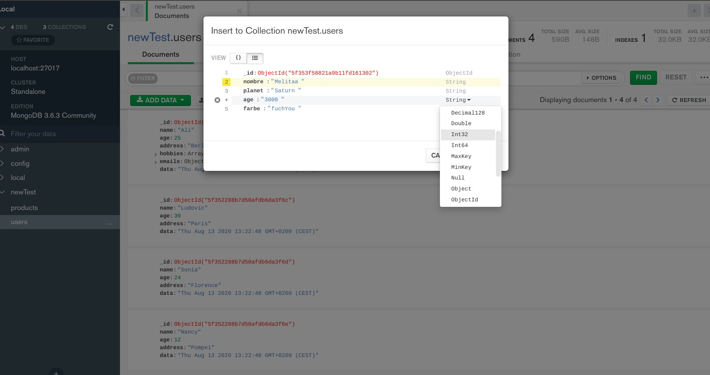
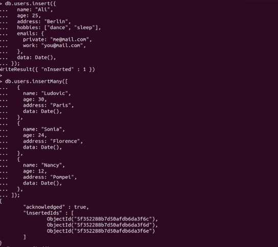

#### To initialize Mongo

<ul>

<li>type : sudo mongod</li>
<li>open another tab and type: mongo</li>
<li>ctrl+L  to clean the window</li>

</ul>

#### Once you are inside the shell type the following:

### create DATABASE

<ul>
<li>the following to know where you are at:   show dbs</li>
<li>the following will create a database, Test is the name i give to it, 'use' is the command: use Test</li>
<li>result: switched to db Test</li>
<li>type 'db' to know where you are at</li>
<li>show dbs</li>
</ul>

### to remove

<ul>
<li>type 'dbs' to know what databases you have, if it show 0.000GB for all the three options is that its empty</li>
<li>type db.dropDatabase();    to remove</li>
<li>result: {'ok': 1}</li>
</ul>

- preview
  

### create a New DATABASE

<ul>
<li>use newTest</li>
<li>result: switched to db newTest</li>
<li>type 'db' to know where you are at</li>
<li>type the following to create a new Collection of data:  db.createcollection('users')</li>
<li>type: show collections </li>
<li>result:  users</li>

</ul>

### go to the VS and make an array like in the image: then copy and paste it in the terminal, this is the vs way of doing it otherwise you have the super easy way in MONGO.

- VS version
  

* MONGO version
  

<ul>

<li>db.users.insert</li>
<li>db.users.insertMany</li>

</ul>

- preview
  
