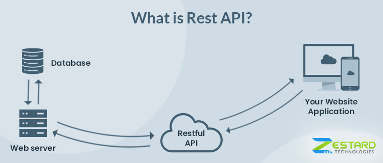
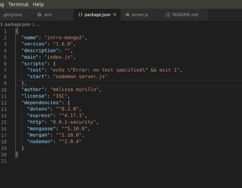
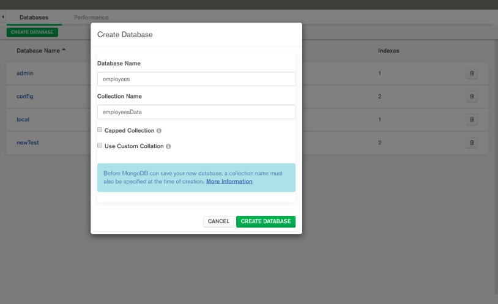
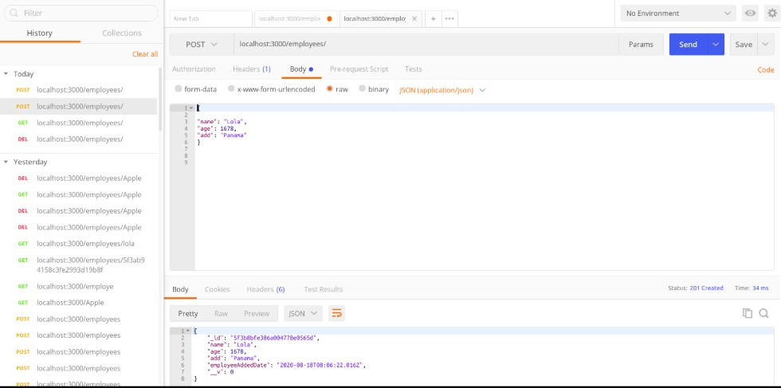

## REST API (REpresentational State Transfer (REST))

It is a protocol used for communication purposes, widely used in diverse web
 service development applications. 
 
 The whole purpose is to establish a client-server communication to obtain the resources from a trusted and secured server. The World Wide Web uses the REST protocol to provide a hypermedia driven interface for websites. Thus, REST API supports multiple formats along with HTML.

## 1)\_ How Does REST Actually Work?

 

 REST suggests the developers create a data object that a client requests and then send the object value in response from the server to the client or user. For instance, if a user requests a particular food item in a specific locality, then you need to create an object on the server-side.

So, now you have an object of the data the user is requesting for, and you are sending the state of the object. Thus, REST transfers the state of an object of data requested by the client from the web or application server.

Due to its architectural style, REST helps in consuming minimal bandwidth. This makes the applications more suitable for the internet. Often described as the “language of the internet”, this protocol is completely based on the resources.

 

#### Text by Ritesh Vatwani

https://www.zestard.com/ - Read More!
[zestard](https://www.zestard.com/blog/rest-api-benefits/)

## Get started

### set up all you need to start the app, install all the dependencies such as:

<ul>

<li>npm init</li>
<li>npm i express</li>
<li>npm i http --save</li>
<li>npm i morgan</li>
<li>npm i mongoose dotenv</li>
<li>npm i nodemon</li>

</ul>

it should look like this:

#### Initialize Mongo and the compass

<ul>

<li>sudo mongod</li>
<li>open another tab and type: mongo</li>
<li>Dont close the tab where you typed mongo</li>
<li>Open the MONGO COMPASS and click in connect </li>

</ul>

### go to the mongo compass and create the database for the employees with the respective collection

#### Start using POSTMAN

Create  an object with Data

<ul>

<li>go to the body</li>
<li>then type on "RAW"</li>
<li>select JSON</li>
<li>create the data like you do it in a normal json file </li>

</ul>

