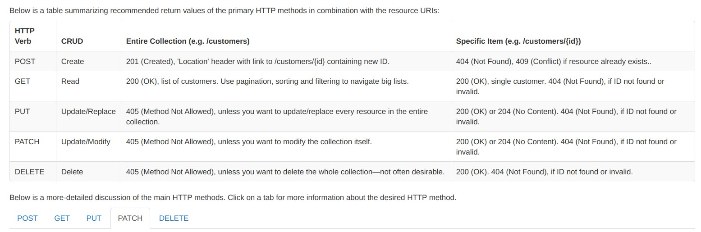

## REST API (REpresentational State Transfer (REST))

It is a protocol used for communication purposes, widely used in diverse web
 service development applications. 
 
 The whole purpose is to establish a client-server communication to obtain the resources from a trusted and secured server. The World Wide Web uses the REST protocol to provide a hypermedia driven interface for websites. Thus, REST API supports multiple formats along with HTML.

## 1)\_ How Does REST Actually Work?

 

 REST suggests the developers create a data object that a client requests and then send the object value in response from the server to the client or user. For instance, if a user requests a particular food item in a specific locality, then you need to create an object on the server-side.

So, now you have an object of the data the user is requesting for, and you are sending the state of the object. Thus, REST transfers the state of an object of data requested by the client from the web or application server.

Due to its architectural style, REST helps in consuming minimal bandwidth. This makes the applications more suitable for the internet. Often described as the “language of the internet”, this protocol is completely based on the resources.

 

#### Text by Ritesh Vatwani

https://www.zestard.com/blog/rest-api-benefits/ - Read More!
[zestard](https://www.zestard.com/)

 
 

 
 

## Get started

### Set up all you need to start the app, install all the dependencies such as:

<ul>

<li>npm init</li>
<li>npm i express</li>
<li>npm i http --save</li>
<li>npm i morgan</li>
<li>npm i mongoose dotenv</li>
<li>npm i nodemon</li>

</ul>

 
 

it should look like this:

 
 

 
 

#### Initialize Mongo and the compass

<ul>

<li>sudo mongod</li>
<li>open another tab and type: mongo</li>
<li>Dont close the tab where you typed mongo</li>
<li>Open the MONGO COMPASS and click in connect </li>

</ul>
 
 

## MONGO COMPASS | Create the database for the employees with the respective collection.

 
 

 
 
 

### Start using POSTMAN

Create  an object with Data

<ul>

<li>go to the body</li>
<li>then type on "RAW"</li>
<li>select JSON</li>
<li>create the data like you do it in a normal json file </li>

</ul>

 
 

### Using HTTP Methods for RESTful Services

 

The HTTP verbs comprise a major portion of our “uniform interface” constraint and provide 
us the action counterpart to the noun-based resource. The primary or most-commonly-used HTTP verbs (or methods, as they are properly called) are POST, GET, PUT, PATCH, and DELETE. These correspond to create, read, update, and delete (or CRUD) operations, respectively. There are a number of other verbs, too, but are utilized less frequently. Of those less-frequent methods, OPTIONS and HEAD are used more often than others.

Below is a table summarizing recommended return values of the primary HTTP methods in combination with the resource URIs:

 

Read More:
[restapitutorial](https://www.restapitutorial.com/lessons/httpmethods.html)

 

 
 

### POST method

The POST verb is most-often utilized to **create** new resources. In particular, it's used to create subordinate resources. That is, subordinate to some other (e.g. parent) resource. In other words, when creating a new resource, POST to the parent and the service takes care of associating the new resource with the parent, assigning an ID (new resource URI), etc.

On successful creation, return HTTP status 201, returning a Location header with a link to the newly-created resource with the 201 HTTP status.

POST is neither safe nor idempotent. It is therefore recommended for non-idempotent resource requests. Making two identical POST requests will most-likely result in two resources containing the same information.

Examples:

<ul>

<li>POST http://www.example.com/customers</li>
<li>POST http://www.example.com/customers/12345/orders</li>

</ul>

 
 

### GET method

The HTTP GET method is used to **read** (or retrieve) a representation of a resource. In the “happy” (or non-error) path, GET returns a representation in XML or JSON and an HTTP response code of 200 (OK). In an error case, it most often returns a 404 (NOT FOUND) or 400 (BAD REQUEST).

According to the design of the HTTP specification, GET (along with HEAD) requests are used only to read data and not change it. Therefore, when used this way, they are considered safe. That is, they can be called without risk of data modification or corruption—calling it once has the same effect as calling it 10 times, or none at all. Additionally, GET (and HEAD) is idempotent, which means that making multiple identical requests ends up having the same result as a single request.

Do not expose unsafe operations via GET—it should never modify any resources on the server.

Examples:

<ul>

<li>GET http://www.example.com/customers/12345</li>
<li>GET http://www.example.com/customers/12345/orders</li>
<li>GET http://www.example.com/buckets/sample</li>
</ul>

 
 

### PUT method

PUT is most-often utilized for **update** capabilities, PUT-ing to a known resource URI with the request body containing the newly-updated representation of the original resource.

However, PUT can also be used to create a resource in the case where the resource ID is chosen by the client instead of by the server. In other words, if the PUT is to a URI that contains the value of a non-existent resource ID. Again, the request body contains a resource representation. Many feel this is convoluted and confusing. Consequently, this method of creation should be used sparingly, if at all.

Alternatively, use POST to create new resources and provide the client-defined ID in the body representation—presumably to a URI that doesn't include the ID of the resource (see POST below).

On successful update, return 200 (or 204 if not returning any content in the body) from a PUT. If using PUT for create, return HTTP status 201 on successful creation. A body in the response is optional—providing one consumes more bandwidth. It is not necessary to return a link via a Location header in the creation case since the client already set the resource ID.

PUT is not a safe operation, in that it modifies (or creates) state on the server, but it is idempotent. In other words, if you create or update a resource using PUT and then make that same call again, the resource is still there and still has the same state as it did with the first call.

If, for instance, calling PUT on a resource increments a counter within the resource, the call is no longer idempotent. Sometimes that happens and it may be enough to document that the call is not idempotent. However, it's recommended to keep PUT requests idempotent. It is strongly recommended to use POST for non-idempotent requests.

Examples:

<ul>

<li>PUT http://www.example.com/customers/12345</li>
<li>PUT http://www.example.com/customers/12345/orders/98765</li>
<li>PUT http://www.example.com/buckets/secret_stuff</li>
</ul>

 
 

### PATCH method

PATCH is used for **modify** capabilities. The PATCH request only needs to contain the changes to the resource, not the complete resource.

This resembles PUT, but the body contains a set of instructions describing how a resource currently residing on the server should be modified to produce a new version. This means that the PATCH body should not just be a modified part of the resource, but in some kind of patch language like JSON Patch or XML Patch.

PATCH is neither safe nor idempotent. However, a PATCH request can be issued in such a way as to be idempotent, which also helps prevent bad outcomes from collisions between two PATCH requests on the same resource in a similar time frame. Collisions from multiple PATCH requests may be more dangerous than PUT collisions because some patch formats need to operate from a known base-point or else they will corrupt the resource. Clients using this kind of patch application should use a conditional request such that the request will fail if the resource has been updated since the client last accessed the resource. For example, the client can use a strong ETag in an If-Match header on the PATCH request.

Examples:

<ul>
<li>PATCH http://www.example.com/customers/12345</li>
<li>PATCH http://www.example.com/customers/12345/orders/98765</li>
<li>PATCH http://www.example.com/buckets/secret_stuff</li>
</ul>

 
 

### DELETE method

DELETE is pretty easy to understand. It is used to **delete** a resource identified by a URI.

On successful deletion, return HTTP status 200 (OK) along with a response body, perhaps the representation of the deleted item (often demands too much bandwidth), or a wrapped response (see Return Values below). Either that or return HTTP status 204 (NO CONTENT) with no response body. In other words, a 204 status with no body, or the JSEND-style response and HTTP status 200 are the recommended responses.

HTTP-spec-wise, DELETE operations are idempotent. If you DELETE a resource, it's removed. Repeatedly calling DELETE on that resource ends up the same: the resource is gone. If calling DELETE say, decrements a counter (within the resource), the DELETE call is no longer idempotent. As mentioned previously, usage statistics and measurements may be updated while still considering the service idempotent as long as no resource data is changed. Using POST for non-idempotent resource requests is recommended.

There is a caveat about DELETE idempotence, however. Calling DELETE on a resource a second time will often return a 404 (NOT FOUND) since it was already removed and therefore is no longer findable. This, by some opinions, makes DELETE operations no longer idempotent, however, the end-state of the resource is the same. Returning a 404 is acceptable and communicates accurately the status of the call.
Examples:

<ul>

<li>DELETE http://www.example.com/customers/12345</li>
<li>DELETE http://www.example.com/customers/12345/orders</li>
<li>DELETE http://www.example.com/bucket/sample</li>
</ul>

 
 
